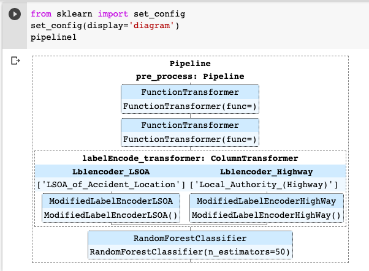

# Road Mishap Risk Analysis
Here I have done the **Accident Severity** Prediction using Police Traffic Records of UK Government under various circumstances.

**Accident Severity Level** ------- Meaning
------------------------------------------------------
        '1'   -------------------------- Fatal
        '2'   -------------------------- Moderate
        '3'   -------------------------- Slight

Implemented 2 methods here for comparison:
1. Randomforest classifier with Hyper-parameter Tuning
2. Convolutional Neural Network

Then I have also demonstrated how to make a Machine Learning Data Pipeline:

- To streamline a lot of the routine processes.
- To encapsulate little pieces of logic into one function call. 
- which makes it easier to actually do modeling instead just writing a bunch of code. 
- when your modeling gets really complicated, it's sometimes hard to see if you have any data leakage hiding somewhere. 
- Pipelines are set up with the fit/transform/predict functionality, 
  - so you can fit a whole pipeline to the training data and transform to the test data, without having to do it individually for each thing you do. 
  - It makes pretty flexible and super convenient to apply the Data mining models on top of your Data 
  - Also provides reusability to the code.

